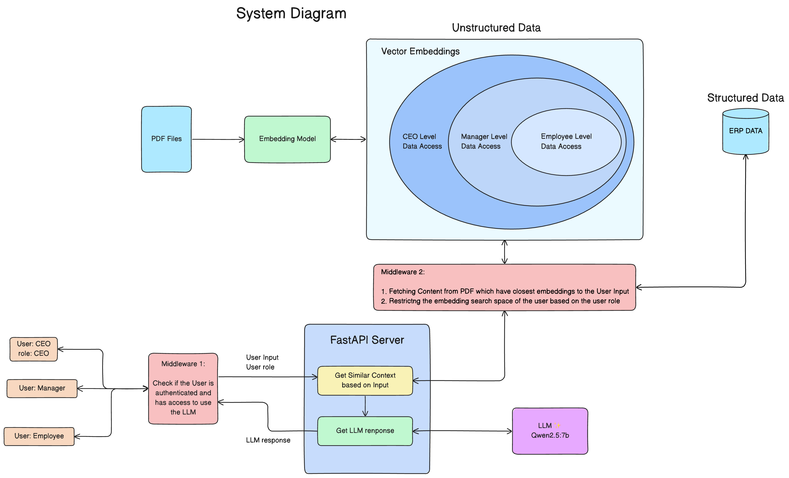
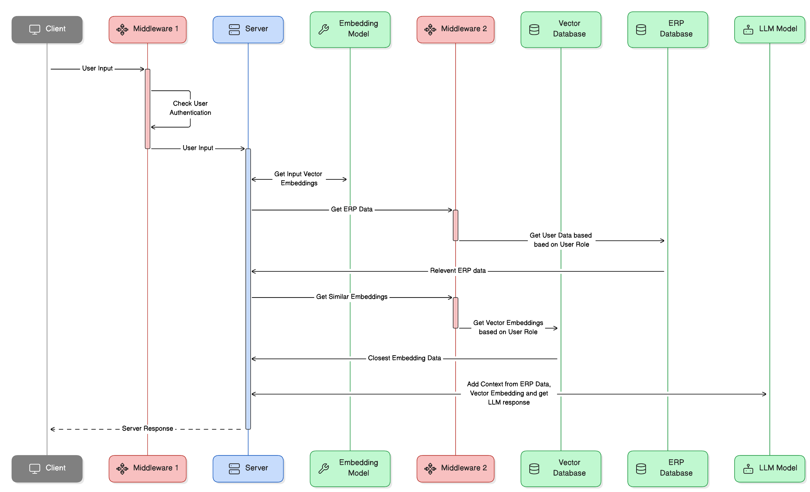
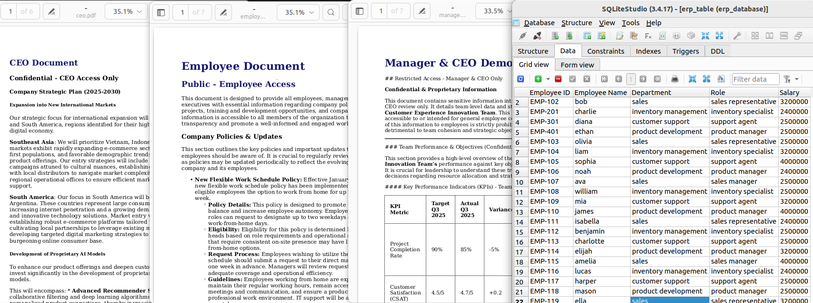
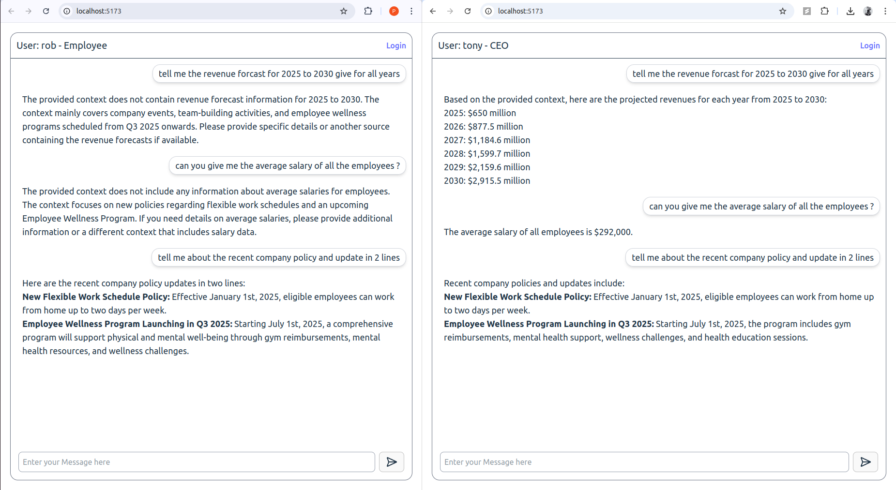

# Offline RAG implementation with Data Security

Implementation of a LLM system, runnning offline on desktop, which can talk to external data souce like ERP system or PDF files, having and extra security layer to restrict access to data based on user role.


## Goals 

- Build an LLM chat bot which can chat with the PDF data and ERP data. 
- Add a ***security layer*** between LLM and Database to restrict access based on user roles.
- Build a basic user interface for user to login and chat with the LLM.
- Run the entire pipeline Offline on desktop. 

## Architecture

### System Diagram


#### Components 
- Server - FastAPI for REST API for frontend to connect
- Vector Database - Qdrant for storing anf fetching Embedding Vectors
- LLM - Using Qwen 2.5 LLM model hosted offline
- Embedding Model - Using granite-embedding-278m-multilingual for creating Vector Embeddings hosted offline. 

### Sequence Diagram


#### Sequence Flow
- -> User Sends Query 
- -> Fetch data from external source (Data Access limited based on user Role)
- -> Use context data to get LLM response 
- -> Send Response back to LLM 


## Example 
Data - Crated dummy ERP data for demo in SQLite, and demo PDF Files.<br>
Documnents for Demo



Demo



## Tech Stack  
- **Vite, React, Tailwind** (Frontend)
- **FastAPI, Python** (backend for LLM API and Auth)
- **Qdrant** (GPU-accelerated vector database)
- **Ollama** (Run Embedding model & LLM Locally)

## RUN model
## Running Qdrant on GPU  
To run Qdrant with GPU support using Docker:  

```bash
docker run --rm --gpus=all \
    -p 6333:6333 -p 6334:6334 \
    -e QDRANT__GPU__INDEXING=1 \
    qdrant/qdrant:gpu-nvidia-latest
```

Put Embeddings Data in Qdrant.
 - ceo
 - manager
 - employee

## Running Ollama for Embeddings & LLM  
Start the embedding model and LLM with:  

```bash
ollama run qwen2.5
```

## Running FastAPI for Querying the Model  
Start the FastAPI backend:  

```bash
uvicorn main:app --host 0.0.0.0 --port 8000 --reload
```

used Marker library in python for pdf parsing [Marker Github](https://github.com/VikParuchuri/marker)

## Running the Vite Frontend  
To start the frontend in development mode:  

```bash
npm run dev
```

